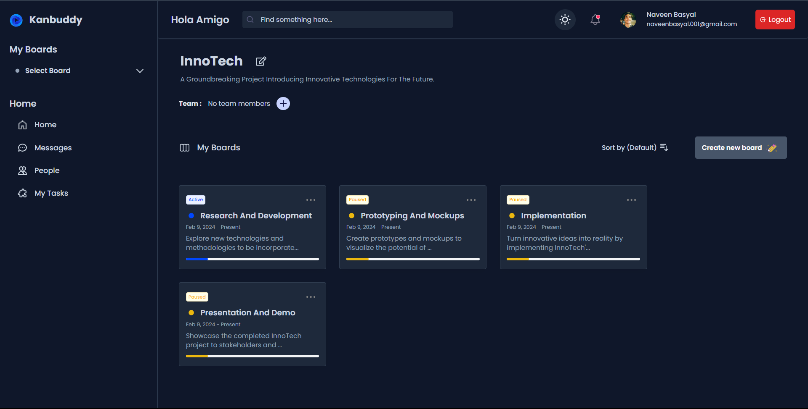

# <span style="color: #3498db;">KanBuddy</span>

## Overview

KanBuddy is a collaborative project management tool designed to help teams efficiently organize tasks and streamline workflow using  Kanban board.


## Features

- **<span style="color: #27ae60;">Kanban Board</span>**: Visualize tasks and workflow through customizable columns.
- **<span style="color: #f39c12;">Real-Time Updates</span>**: Experience instant updates on changes made by team members.
- **<span style="color: #d35400;">Task Management</span>**: Add, edit, and delete tasks with ease.
- **<span style="color: #9b59b6;">Collaboration</span>**: Assign tasks, add labels, and leave comments for effective teamwork.
- **<span style="color: #c0392b;">Project Management</span>**: Create and manage projects effortlessly.

## Screenshots





## Getting Started

### Prerequisites

- Node.js and npm installed
- MongoDB database

### Installation

1. **<span style="color: #3498db;">Clone the repository:</span>**

   ```bash
   git clone https://github.com/naveenbasyal/kanban.git

   ```

2. **<span style="color: #3498db;">Install dependencies:</span>**

   ```bash
   cd kanban/client
   npm install
   cd ../server
   npm install

   ```

3. **<span style="color: #3498db;">Create a .env file:</span>**

   ```bash
   cd server
   touch .env

   Add the following environment variables to the .env file:


   MONGODB_URI=your_mongodb_uri
   JWT_SECRET=your_jwt_secret

   cd client

   touch .env

   Add the following environment variables to the .env file:

   REACT_APP_SERVER_URL=your_server_url
   REACT_APP_CLIENT_ID=your_google_client_id


   ```

4. **<span style="color: #3498db;">Run the application:</span>**

   ```bash
   cd server
   npm start
   ```

   ```bash
   cd client
   npm start
   ```

   ```
   Open [http://localhost:3000](http://localhost:3000) to view it in the browser.
   ```

   ```
   The server will run on [http://localhost:8000](http://localhost:8000).
   ```

   ```
   The client will run on [http://localhost:3000](http://localhost:3000).
   ```
